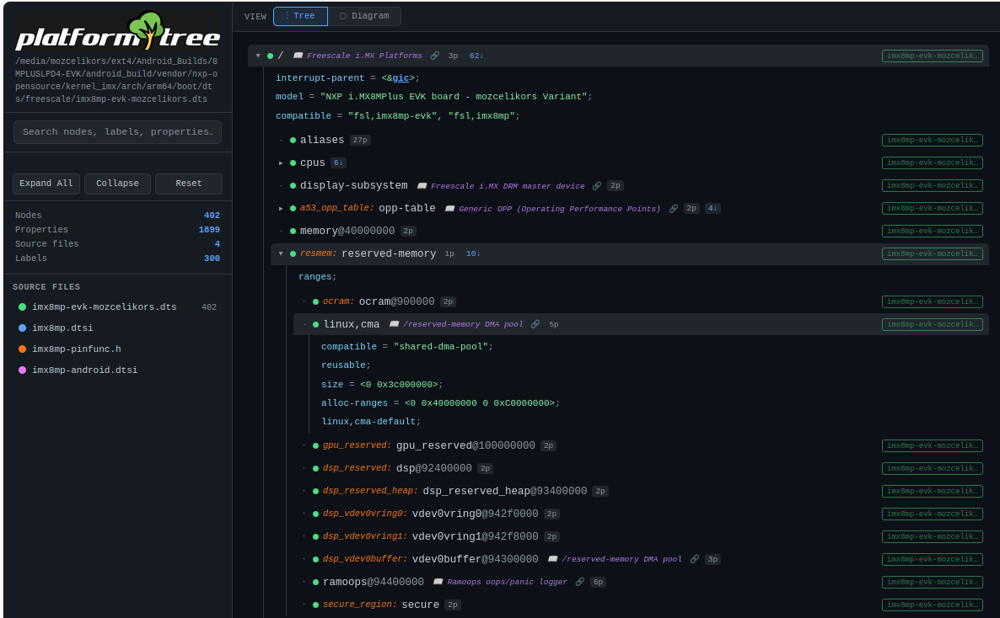
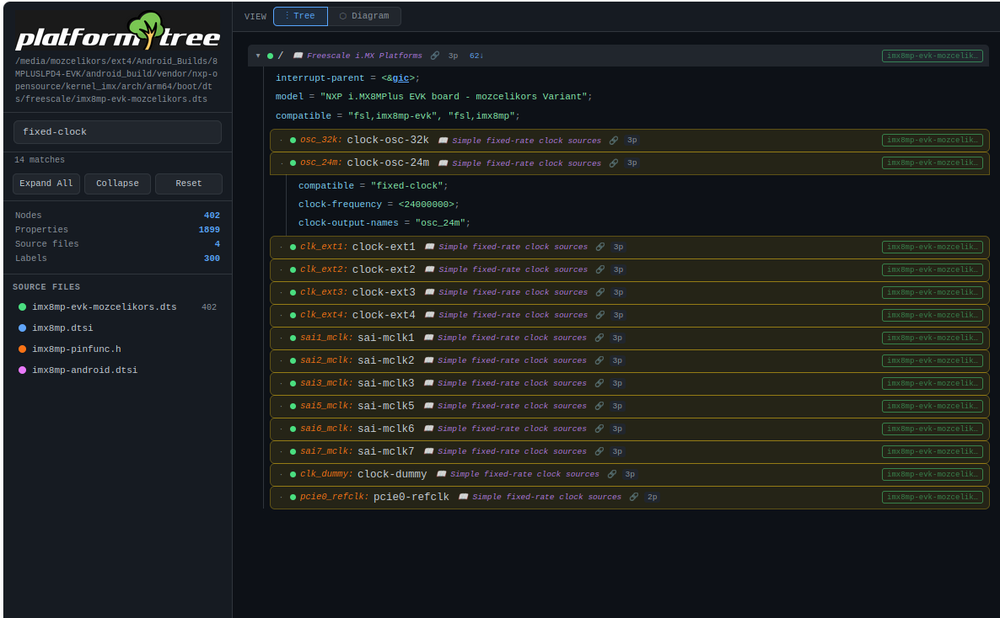
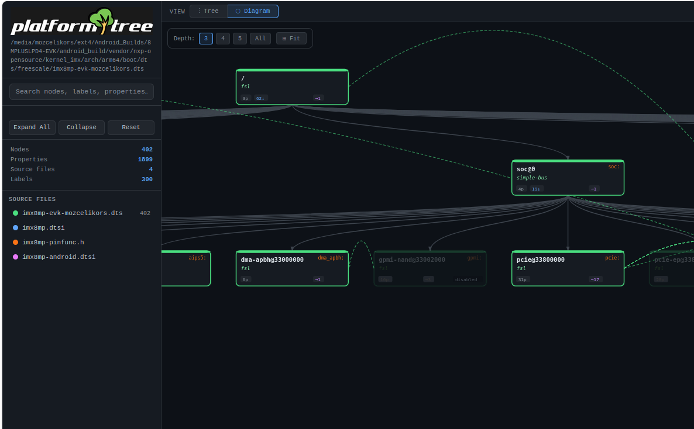
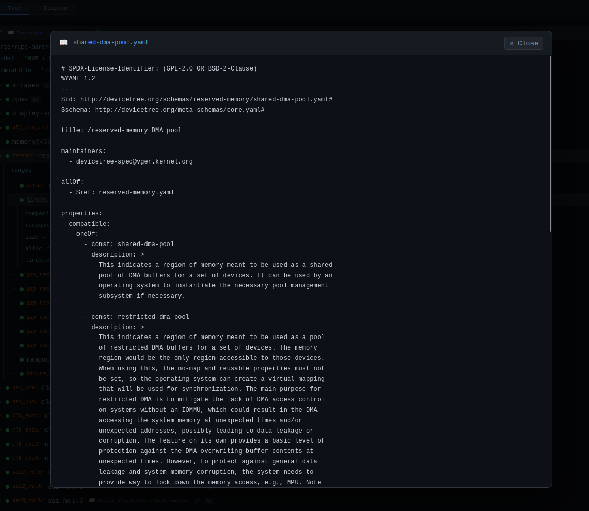
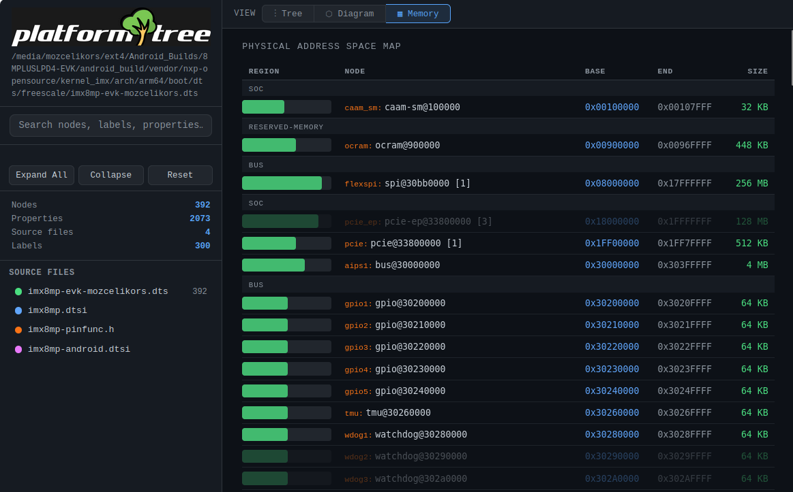
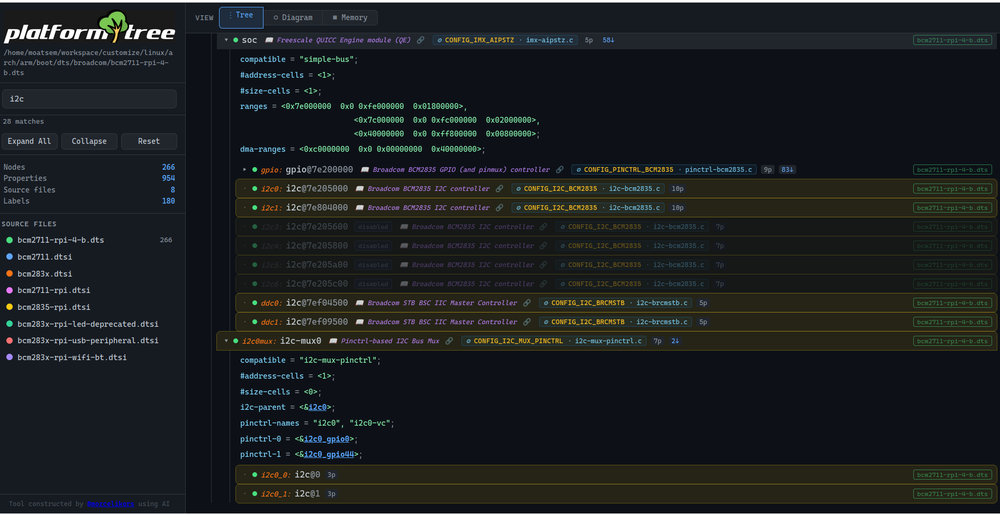

# platformtree (Device Tree Visualizer)

`platformtree` is a lightweight, high-performance C utility designed to tame the complexity of Linux Device Tree sources. It recursively resolves nested `#include` directives and merges overlays to generate a single, interactive, and color-coded HTML visualization of your hardware topology.

Whether you are debugging a complex i.MX8MP platform or trying to track down which `.dtsi` file is overriding your `status`, `platformtree` provides a clear source of truth before you dig deep down into the platform architecture.

Since the tool parses .yml based documentation files, there are false positives expected very rarely if a module documentation is not written in expected proper format.

---

# Key Features

- **Recursive Resolution**\
  Fully resolves `#include "..."` stacks to build a complete system view.

- **Overlay Merging**\
  Supports `&label { ... }` syntax, accurately merging properties across multiple files.

- **Node Management**\
  Handles advanced DT syntax including `/delete-node/` and `/delete-property/`.

- **Smart Labeling**\
  Supports node labels (`label: node@addr`) and multiple labels per node.

- **Interactive Navigation**\
  Jump between `&label` references directly within the HTML output.

- **Visual Hierarchy**\
  Per-file color coding ensures you know exactly which file defined which property.

- **Documentation Parsing**\
  Parses devicetree documentation, matches compatible property in order to bring driver information.

- **Driver / Kconfig Discovery**\
  Optionally indexes a kernel source tree (`drivers/`, `sound/`, `net/`, `fs/`, ...), scans every `.c` file for `.compatible = "..."` entries, and parses adjacent Makefiles for `obj-$(CONFIG_X) += driver.o`. Each tree node is then labelled inline with the responsible driver C file and the Kconfig symbol that enables it.

- **Memory View**\
  Parses allocated memory mapped IO as well as reserved regions to come up with a tentative memory map.


---

# Visualization Output

The generated HTML provides a hierarchical view of the Device Tree.

| Feature            | Description                                                                |
| ------------------ | -------------------------------------------------------------------------- |
| Interactive Tree   | Expand/collapse nodes to focus on specific peripherals (I2C, SPI, UART).   |
| Color Coding       | Each source file is assigned a unique color to trace property inheritance. |
| Reference Links    | Clickable labels to instantly navigate the hardware graph.                 |
| Property Inspector | View booleans, strings, and hex values in a clean, readable format.        |


# Pictures








---


# Quick Start

## Build

Compile the tool using `gcc`. The `-O2` flag is recommended for faster parsing of large DT sets.

```bash
gcc -O2 -Wall -o platformtree platformtree.c
```

## Usage

```bash
./platformtree <dts-folder> <main.dts> [devicetree-doc-folder] [kernel-src]
```

### Mandatory Arguments

`devicetree-doc-folder` is the path to the folder that contains all the relevant devicetree files that is wanted to be included in the tree. If your devicetree tree is split across multiple folders, it is highly recommended that you merge them before using the tool.

`main.dts` is the main devicetree file that you want the platformtree tool to analyze.

### Optional Arguments

`devicetree-doc-folder`, when provided, used for fetching information regarding drivers.

`kernel-src` is the kernel source root. When supplied, each node receives a `⚙ CONFIG_X · driver.c` badge derived from the kernel's own `.compatible` declarations and adjacent Makefiles. If `devicetree-doc-folder` is left as `""` and `kernel-src` is provided, the doc folder is auto-derived as `<kernel-src>/Documentation/devicetree/bindings`.

### Example Usage

```bash
./platformtree kernel_imx/arch/arm64/boot/dts/freescale kernel_imx/arch/arm64/boot/dts/freescale/imx8mp-evk-mozcelikors.dts kernel_imx/Documentation/devicetree/bindings kernel_imx
```

To skip the docs folder but still wire up driver/Kconfig discovery:

```bash
./platformtree kernel/arch/arm/boot/dts/broadcom kernel/arch/arm/boot/dts/broadcom/bcm2711-rpi-4-b.dts "" kernel
```

### Input

Your directory containing `.dts` and `.dtsi` files.

### Output

A self-contained `devicetree_viz.html` file.

---

# Technical Considerations

This tool is built specifically for embedded engineers working with complex SoC architectures where hardware descriptions are spread across dozens of include files.

`platformtree` handles the Device Tree "pre-processor" logic internally, allowing you to see the final state of the tree as the kernel would see it, while preserving source-level attribution for every property and node.

---

> [!NOTE] Tool envisioned and constructed by mozcelikors. Coded by AI.

---

